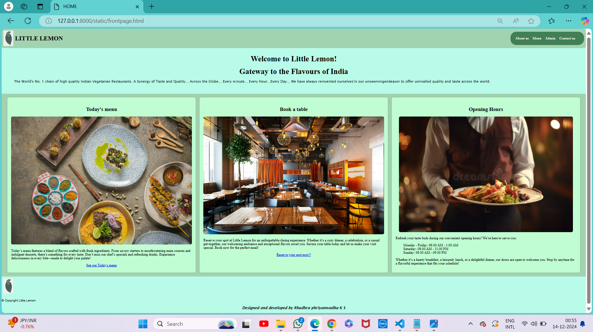
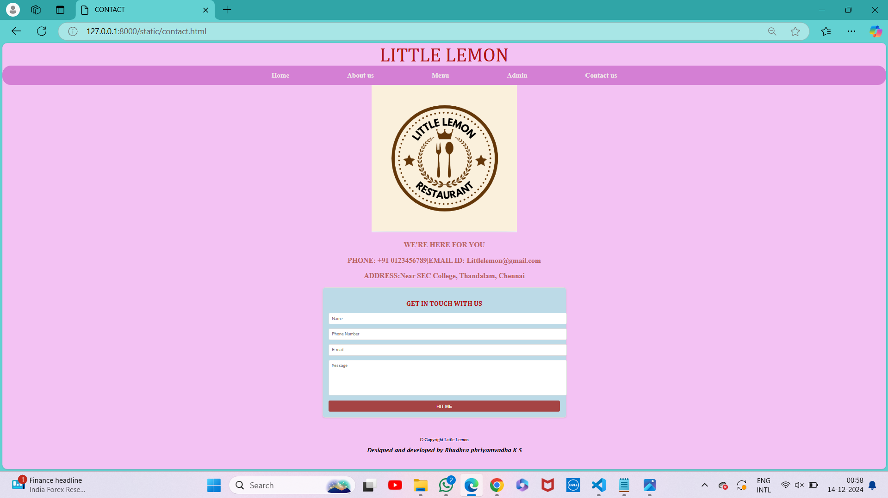

# Ex.07 Restaurant Website
## Date: 11.12.2024

## AIM:
To develop a static Restaurant website to display the food items and services provided by them.

## DESIGN STEPS:

### Step 1:
Requirement collection.

### Step 2:
Creating the layout using HTML and CSS.

### Step 3:
Updating the sample content.

### Step 4:
Choose the appropriate style and color scheme.

### Step 5:
Validate the layout in various browsers.

### Step 6:
Validate the HTML code.

### Step 7:
Publish the website in the given URL.

## PROGRAM:
```
frontpage.html

<!DOCTYPE html>
<html lang="en">
<head>
    <meta charset="UTF-8">
    <meta name="viewport" content="width=device-width, initial-scale=1.0">
    <title>HOME</title>
</head>

<style>

    body {
    font-family: Arial, sans-serif;
    margin: 0;
    padding: 0;
    background-color: #b9fbe9;
}

header {
    display: flex;
    justify-content: space-between;
    align-items: center;
    padding: 10px;
    background-color: rgb(162, 211, 176);
    border-radius: 10px;
}

.menu{
    background-color: rgb(65, 127, 85);
    align-items: center;
    color: rgb(229, 250, 4);
    padding: 25px;
    border-radius: 30px;
}
.logo {
    display: flex;
    align-items: center;
}

.logo img {
    width: 50px;
    height: 80px;
    margin-right: 10px;
}

nav ul {
    list-style: none;
    display: flex;
    margin: 0;
    padding: 0;
}

nav ul li {
    margin-right: 20px;
}

.footer{
    padding: 10px 10px;
}

nav ul li a {
    text-decoration: none;
    font-family: 'Times New Roman', Times, serif;
    font-size: large;
    color: #f0e9e9;
    font-weight: bold;
}

.offer-txt{
    color: black;
}
.hours{
    width: 900px;
    height: 400px;
}

.banner {
    text-align: center;
    background-image: url('c:\\Users\\phriy\\OneDrive\\Pictures\\Screenshots\\homepage.jpg');
    padding: 10px 40px;
    color: #fff;
    border-radius: 10px;
    margin: 25px;
}

.banner h2 {
    font-size: 2.5em;
    margin: 0 0 20px;
}

.features {
    display: flex;
    justify-content: space-around;
    padding: 20px;
    background-color: rgb(162, 211, 176);
}

.feature {
    text-align: center;
    font-family: 'Times New Roman', Times, serif;
    font-size: large;
    background-color: rgb(192, 253, 211);
    padding: 20px;
    border-radius: 8px;
    box-shadow: 0 0 10px rgba(0, 0, 0, 0.1);
    flex: 1;
    margin: 0 10px;
}

.feature h3 {
    font-size: 1.5em;
    margin-bottom: 20px;
}

.feature img {
    max-width: 100%;
    height: auto;
    border-radius: 8px;
}

p {
    text-align: left;
}

ul {
    text-align: left;
}

.copy{
    margin-left: auto
}

.hyperlink{
    color: blue;
}
    

</style>
<body>
    <header>
        <div class="logo">
            
            <h1 style="font-family: 'Times New Roman', Times, serif;">LITTLE LEMON</h1>
        </div>
        <nav class="menu">
            <ul>
                <li><a href="home.html">About us </a></li>
                <li><a href="menu.html">Menu</a></li>
                <li><a href="admin.html">Admin</a></li>
                <li><a href="contact.html">Contact us</a></li>
            </ul>
        </nav>
    </header>
    <main>
        <section class="banner" style="background-image: url(atatic//homepage.jpg);">         
            <h2 class="offer-txt" style="font-family: 'Times New Roman', Times, serif;">Welcome to Little Lemon!</h2>
            <h2 class="offer-txt" style="font-family: 'Times New Roman', Times, serif;"> Gateway to the Flavours of India</h2>
            
            <p class = 'offer-txt' style="font-size: large ; font-family: 'Lucida Sans', 'Lucida Sans Regular', 'Lucida Grande', 'Lucida Sans Unicode', Geneva, Verdana, sans-serif;">The World's No. 1 chain of high quality Indian Vegetarian Restaurants. A Synergy of Taste and Quality... Across the Globe... Every minute... Every Hour...Every Day...
                We have always reinvented ourselves'in our unswervingendeavor to offer unrivalled quality and taste across the world.</p>
        </section>
        <section class="features">
            <div class="feature">
                <h3>Today's menu</h3>
                
                <p> Today’s menu features a blend of flavors crafted with fresh ingredients. From savory starters to mouthwatering main courses and indulgent desserts, there’s something for every taste.
                     Don’t miss our chef’s specials and refreshing drinks. Experience deliciousness in every bite—made to delight your palate!</p>
                <a href="www.google.com">See our Today's menu</a>
            </div>
            <div class="feature">
                <h3>Book a table</h3>
                
                <p>Reserve your spot at Little Lemon for an unforgettable dining experience. Whether it’s a cozy dinner, a celebration, or a casual get-together, our welcoming ambiance and exceptional flavors await you. 
                    Secure your table today and let us make your visit special. Book now for the perfect meal!</p>
                <a href="www.google.com">Reserve your spot now!!</a>
            </div>
            <div class="feature">
                <h3>Opening Hours</h3>
                
                <p>Refresh your taste buds during our convenient opening hours! We’re here to serve you: </p>
                <ul>
                    Monday - Friday: 06:00 AM - 1:00 AM <br>
                    Saturday: 08:00 AM - 11:00 PM <br>
                    Sunday: 08:00 AM - 09:00 PM <br>
                </ul>
                <p> Whether it’s a hearty breakfast, a leisurely lunch, or a delightful dinner, our doors are open to welcome you. Stop by anytime for a flavorful experience that fits your schedule!</p>
            </div>
        </section>
        <footer>
            <div class="logo">
                
            </div>
            
                <p align="center" class="copy">&copy; Copyright Little Lemon</p>

            <h3 align="center" style="font-family:'Lucida Sans', 'Lucida Sans Regular', 'Lucida Grande', 'Lucida Sans Unicode', Geneva, Verdana, sans-serif; font-style: italic; ">
                Designed and developed by Rhudhra phriyamvadha K S</h3>
        </footer>
    </main>
</body>
</html>
```
```
home.html

<!DOCTYPE html>
<html lang="en">
<head>
    <meta charset="UTF-8">
    <meta name="viewport" content="width=device-width, initial-scale=1.0">
    <title>HOME</title>
</head>

<style>
body{
    background-color: rgb(16, 204, 195) ;
}

    header{
        text-align: center;
        font-size: 50px;
        font-style:initial;
        background-color: rgb(31, 107, 103);
    }
    .content{
        font-size: medium;
        padding: 10px;
        font-family:'Lucida Sans', 'Lucida Sans Regular', 'Lucida Grande', 'Lucida Sans Unicode', Geneva, Verdana, sans-serif
    }

    .menu{
    background-color: rgb(17, 86, 82);
    align-items: center;
    display: flex;
    justify-content: center;
    color: rgb(229, 250, 4);
    padding: 20px;
    
    
}
    nav ul {
    list-style: none;
    display: flex;
    margin: 0;
    padding: 0;
}

nav ul li {
    margin-right: 20px;
    margin-left: 20px;
}

.footer{
    padding: 10px 10px;
}

nav ul li a {
    text-decoration: none;
    text-align: center;
    font-family: 'Times New Roman', Times, serif;
    padding: 90px;
    font-size: larger;
    color: #f0e9e9;
    font-weight: bold;
}
</style>
<body>
     
        <header style="color: rgb(246, 245, 245);">
            <h3>LITTLE LEMON</h3>
    </header>

            <nav class="menu" >
                <ul>
                    <li><a href="frontpage.html">Home</a></li>
                    <li><a href="home.html">About us</a></li>
                    <li><a href="menu.html">Menu</a></li>
                    <li><a href="admin.html">Admin</a></li>
                    <li><a href="contact.html">Contact us</a></li>
                </ul>
            </nav>
        
     <center>
        
        
        <div class="content">
        <h2> Welcome to LITTLE LEMON Restaurent. A Wonderful Dining Experience Like No Other</h2>
        <h2>Here's a mesmerizing description of a restaurant</h2>
        <p style="font-family:cursive; font-size: large;">
            "As you step through the doors of 'LITTLE LEMON', a symphony of sensory delights and envelops you, 
            transporting you to a world of epicurean bliss. Soft and golden light spills from ornate chandeliers, 
            casting a warm glow on the rich, velvety textures of the furnishings of the dishes.The air is alive with the intoxicating aromas of the exotic spices from the nature,
            freshly baked bread, and slow-cooked meats, teasing your taste buds and building anticipation for the feast in your way.
            As you peruse the menu, your eyes widen with wonder at the innovative fusion of flavors and techniques,
            expertly crafted by the culinary maestros in the kitchen. Each dish is a masterpiece of presentation and taste istexture, 
            with every bite a harmonious balance of textures, temperatures, and flavors that will leave you spellbound and yearning for more.
            In 'LITTLE LEMON', every meal is a journey of discovery, a sensory odyssey of the food all over the world that will delight, surprise, and leave you enchanted. 
            Come, indulge your senses. Enter into the the world of tasty and enjoy the spices.................

            
                                     "WELCOME TO THE WORLD OF LITTLE LEMON"</p>
        </div>

        <div class="content">
            <h2>Exploring culinary treasure</h2>
               <p> Rich and buttery flavors mixed with authentic spices of India, our menu is full of exciting food items with the traditional taste of Indian cuisine.</p>
            
               <h3 style="font-family:'Trebuchet MS', 'Lucida Sans Unicode', 'Lucida Grande', 'Lucida Sans', Arial, sans-serif;">Serving Traditional recipes</h3>
            <p> We are serving dishes prepared with traditional recipes with exceptional taste and best quality ingredients.</p>
            
            
            <h3 style="font-family:'Trebuchet MS', 'Lucida Sans Unicode', 'Lucida Grande', 'Lucida Sans', Arial, sans-serif;">Original Recipies</h3>
            <p>Enjoy the dishes made from our original recipes as we craft the old recipes while adding our ultimate twist to it.</p>

            
            <h3 style="font-family:'Trebuchet MS', 'Lucida Sans Unicode', 'Lucida Grande', 'Lucida Sans', Arial, sans-serif;">Fastest Delivery</h3>
            <p>No more waiting long hours for your tempting food, with Little Lemon, your food will arrive on time!</p>

        </div>
        <footer>
            
                <p align="center" class="copy">&copy; Copyright Little Lemon</p>

            <h3 align="center" style="font-family:'Lucida Sans', 'Lucida Sans Regular', 'Lucida Grande', 'Lucida Sans Unicode', Geneva, Verdana, sans-serif; font-style: italic; ">
               Designed and developed by Rhudhra phriyamvadha K S</h3>
        </footer>
    </center>
    <div class="logo">
        
    </div>
    

</body>
</html>
```
```
menu.html

<!DOCTYPE html>
<html lang="en">
<head>
    <meta charset="UTF-8">
    <meta name="viewport" content="width=device-width, initial-scale=1.0">
    
    <title>MENU</title>
        </div>

    <style>
        body {
            font-family:'Times New Roman', Times, serif;
            margin: 0;
            padding: 0;
            background-image: url('https://example.com/background.jpg'); /* Replace with your background image */
            background-size: cover;
            background-position: center;
            background-attachment: fixed;
            color: #ffffff;
        }

        /* Overlay to darken the background image */
        .overlay {
            position: absolute;
            top: 0;
            left: 0;
            width: 100%;
            height: 100%;
            background-color: lavender;
            z-index: -1;
        }

        /* Main container */
        .menu-container {
            width: 80%;
            margin: 50px auto;
            background-color: rgba(222, 196, 220, 0.9);
            padding: 30px;
            border-radius: 15px;
            box-shadow: 0 4px 8px rgba(245, 179, 243, 0.16);
            color: #333;
        }

        
        header {
            text-align: center;
            padding: 20px 0;
            color: #fff;
            background-color: #723c6b; 
            border-radius: 15px 15px 0 0;
        }

        header h1 {
            margin: 0;
            font-size: 30px;
        }

       
        h2 {
            text-align: center;
            color: #27ae60; 
            border-bottom: 2px solid #d35400;
            font-size: 25px;
            margin-bottom: 20px;
        }

        
        .menu-item {
            display: flex;
            justify-content: space-between;
            margin-bottom: 20px;
            align-items: center;
        }

        .menu-item img {
            width: 150px;
            height: 100px;
            border-radius: 10px;
            object-fit: cover;
        }

        .menu-item-details {
            flex-grow: 1;
            margin-left: 18px;
        }

        .menu-item-name {
            font-size: 20px;
            font-weight: bold;
            color: #34495e;
        }

        .menu-item-price {
            font-size: 20px;
            color: #e74c3c;
        }

        .description {
            font-size: 16px;
            color: #7f8c8d;
        }

        
        .footer {
            text-align: center;
            padding: 20px;
            color: #bdc3c7;
        }

        @media screen and (max-width: 768px) {
            .menu-container {
                width: 95%;
            }

            .menu-item {
                flex-direction: column;
                align-items: flex-start;
            }

            .menu-item img {
                margin-bottom: 10px;
            }
        }

        .menu{
    background-color: #7023669c;
    align-items: left;
    display: flex;
    justify-content: center;
    color: rgb(229, 250, 4);
    padding: 20px;
    align-items: center;
   
}

        nav ul {
    list-style: none;
    display: flex;
    margin: 0;
    padding: 0;
}

nav ul li {
    margin-right: 20px;
    margin-left: 20px;
}

.footer{
    padding: 10px 10px;
}

nav ul li a {
    text-decoration: none;
    font-family: 'Times New Roman', Times, serif;
    padding: 90px;
    font-size: larger;
    color: #f0e9e9;
    font-weight: bold;
}
    </style>
</head>
<body bgcolor="lavender">
<div class="overlay"></div>

<header>
    <h1>WELCOME TO OUR RESTAURENT</h1> 
</header> 

    
    <nav class="menu">
        <ul>
            <li><a href="frontpage.html">Home</a></li>
            <li><a href="home.html">About us</a></li>
            <li><a href="menu.html">Menu</a></li>
            <li><a href="admin.html">Admin</a></li>
            <li><a href="contact.html">Contact us</a></li>
        </ul>
    </nav>


<div class="menu-container">

    <div class="menu-section">
        <h2>STARTERS</h2>
        <div class="menu-item">
             <!-- Replace with your image -->
            <div class="menu-item-details">
                <p class="menu-item-name">Veg samosa</p>
                <p class="description">Fried with groundnut oil with mashed potato masala.</p>
            </div>
            <p class="menu-item-price">Rs.25</p>
        </div>

        <div class="menu-item">
             
            <div class="menu-item-details">
                <p class="menu-item-name">Gobi manchurian</p>
                <p class="description">Savory cauliflower tossed with rich chinese sauces.</p>
            </div>
            <p class="menu-item-price">Rs.90</p>
        </div>
        <div class="menu-item">
             
            <div class="menu-item-details">
                <p class="menu-item-name">Chicken 65</p>
                <p class="description">High quality chicken fried and served with rich flavors.</p>
            </div>
            <p class="menu-item-price">Rs.150</p>
        </div>
        <div class="menu-item">
            
            <div class="menu-item-details">
                <p class="menu-item-name">Veg cutlet</p>
                <p class="description">Mashed potato, vegetables, fried as paties.</p>
            </div>
            <p class="menu-item-price">Rs.75</p>
    </div>
    <div class="menu-item">
         
        <div class="menu-item-details">
            <p class="menu-item-name">Paneer roll</p>
            <p class="description">Freshly made paneer rolled by a wrap with some veggies.</p>
        </div>
        <p class="menu-item-price">Rs.50</p>
</div>
<div class="menu-item">
     
    <div class="menu-item-details">
        <p class="menu-item-name">Chicken tikka kebab</p>
        <p class="description">High quality chicken grilled with some veggies.</p>
    </div>
    <p class="menu-item-price">Rs.70</p>
</div>

    

    <div class="menu-section">
        <h2>MAIN COURSES</h2>
        <div class="menu-item">
             
            <div class="menu-item-details">
                <p class="menu-item-name">Dosa</p>
                <p class="description">Thin crepe served with sambar and chutney.</p>
            </div>
            <p class="menu-item-price">Rs.40</p>
        </div>

        <div class="menu-item">
             
            <div class="menu-item-details">
                <p class="menu-item-name">Chicken Biriyani</p>
                <p class="description">Delicious biriyani made with high quality chicken and rice.</p>
            </div>
            <p class="menu-item-price">Rs.99</p>
        </div>
    </div>
    <div class="menu-item">
         
        <div class="menu-item-details">
            <p class="menu-item-name">Parotta</p>
            <p class="description">Soft and flaky parottas served with varieties of currys.</p>
        </div>
        <p class="menu-item-price">Rs.55</p>
    </div>
</div>
<div class="menu-item">
     
    <div class="menu-item-details">
        <p class="menu-item-name">Naan with paneer butter masala</p>
        <p class="description">Soft and falky naan made with fresh panner and butter.</p>
    </div>
    <p class="menu-item-price">Rs.80</p>
</div>
<div class="menu-item">
     <!-- Replace with your image -->
    <div class="menu-item-details">
        <p class="menu-item-name">Chapthi with chicken curry</p>
        <p class="description">SOft and flaky chapathi served with a curry made of high quality chicken.</p>
    </div>
    <p class="menu-item-price">Rs.95</p>
</div>


    <div class="menu-section">
        <h2>DESSERTS</h2>
        <div class="menu-item">
             
            <div class="menu-item-details">
                <p class="menu-item-name">Rasagulla</p>
                <p class="description">Soft and fluffy ball made from malai and soaked in sugar water.</p>
            </div>
            <p class="menu-item-price">Rs.55</p>
        </div>

        <div class="menu-item">
             
            <div class="menu-item-details">
                <p class="menu-item-name">Gulab jamun</p>
                <p class="description">Soft and fluffy ball made from kova and flour and soaked in sugar water.</p>
            </div>
            <p class="menu-item-price">Rs.55</p>
        </div>
    </div>
    <div class="menu-item">
         
        <div class="menu-item-details">
            <p class="menu-item-name">Rasamalai</p>
            <p class="description">Soft disks made from malai and soaked in sweet and flavorful milk.</p>
        </div>
        <p class="menu-item-price">Rs.65</p>
    </div>
    <div class="menu-item">
         
        <div class="menu-item-details">
            <p class="menu-item-name">Kaju katli</p>
            <p class="description">Soft and made with cashews and topped with silver foil.</p>
        </div>
        <p class="menu-item-price">Rs.70</p>
    </div>
    
        
    <div class="menu-section">
    <h2>DRINKS</h2>
        <div class="menu-item">
            
            <div class="menu-item-details">
                <p class="menu-item-name">Coffee</p>
                <p class="description">Milk,sugar and coffee powder</p>
            </div>
            <p class="menu-item-price">Rs.20</p>
        </div>
        <div class="menu-item">
             
            <div class="menu-item-details">
                <p class="menu-item-name">Tea</p>
                <p class="description">Milk,sugar and tea powder.</p>
            </div>
            <p class="menu-item-price">Rs.20</p>
        </div>
        <div class="menu-item">
             
            <div class="menu-item-details">
                <p class="menu-item-name">Milkshake</p>
                <p class="description">Milk added cream and with varieties of flavor</p>
            </div>
            <p class="menu-item-price">Rs.40</p>
        </div>
        <div class="menu-item">
             
            <div class="menu-item-details">
                <p class="menu-item-name">Fresh juices</p>
                <p class="description">Fresh friuts are blended with sugar and ice.</p>
            </div>
            <p class="menu-item-price">Rs.50</p>
        </div>
    </div>
        
        
    <tr>
        <td><h4 style="font-size: larger; font-family: Verdana, Geneva, Tahoma, sans-serif;"><center>Taste the difference 🧋, Return for excellence 😜!!!</center></h4></td>
    </tr>
    <p style="font-size: large; font-family: 'Times New Roman', Times, serif; color:deeppink;"><b>WE'RE HERE FOR YOU</b></p>
    <p style="font-size: large; font-family: 'Times New Roman', Times, serif; color: deeppink;"><b>PHONE: +91 0123456789| EMAIL ID: littlelemon@gmail.com</b></p>
    <p style="font-size: large; font-family: 'Times New Roman', Times, serif; color: deeppink;"><b>ADDRRESS: Near SEC College, Thandalam, Chennai</b></p>

    <footer>
        
            <p align="center" class="copy">&copy; Copyright Little Lemon</p>

        <h3 align="center" style="font-family:'Lucida Sans', 'Lucida Sans Regular', 'Lucida Grande', 'Lucida Sans Unicode', Geneva, Verdana, sans-serif; font-style: italic; ">
            Developed and designed by Rhudhra phriyamvadha K S</h3>

            <div class="logo">
                
            </div>
            
    </footer>
</body>
</html>
```
```
admin.html

<!DOCTYPE html>
<html lang="en">
<head>
    <meta charset="UTF-8">
    <meta name="viewport" content="width=device-width, initial-scale=1.0">
    <title>ADMINISTRATION</title>
</head>

<style>
    body{
        background-color: cornsilk;
    }

    header{
        font-size: 50px;
        font-family:'Lucida Sans', 'Lucida Sans Regular', 'Lucida Grande', 'Lucida Sans Unicode', Geneva, Verdana, sans-serif;
        background-color: burlywood;
    }

    footer{
        font-size: 20px;
        background-color: burlywood;
    }

    .copy{
    margin-left: auto
    }

    .menu{
    background-color: rgb(171, 136, 90);
    align-items: center;
    display: flex;
    justify-content: center;
    color: rgb(229, 250, 4);
    padding: 20px;
    border-radius: 50px;
    
}

    nav ul {
    list-style: none;
    display: flex;
    margin: 0;
    padding: 0;
}

nav ul li {
    margin-right: 20px;
    margin-left: 20px;
}

.footer{
    padding: 10px 10px;
    
}

.copy{
    margin-left: auto;
    padding-top: 50px;
    
}
nav ul li a {
    text-decoration: none;
    font-family: 'Times New Roman', Times, serif;
    padding: 90px;
    font-size: larger;
    color: #f0e9e9;
    font-weight: bold;
}

</style>

<body>
    <center>
    <header>
       OUR SENATE
    </header>
        <nav class="menu">
            <ul>
                <li><a href="frontpage.html">Home</a></li>
                <li><a href="home.html">About us</a></li>
                <li><a href="menu.html">Menu</a></li>
                <li><a href="admin.html">Admin</a></li>
                <li><a href="contact.html">Contact us</a></li>
            </ul>
        </nav>
    
    <h1>LITTLE LEMON RESTAURENT</h1>
    <p style="font-size: larger;">The Little lemon restaurent is a premium South Indian restaurent. At the little lemon it is ensured that all the cuisines are prepared 
        on-the-go and served hot to customers using the best and fresh highquality ingredients, authentic recipes with the highest hygiene standards.
    </p>

    <h2>What makes the Little lemon restaurant unique?</h2>
    <p style="font-size: larger;">
        The tastes and the quality of the food is consistent across all the outlets. With uncompromised quality, it is open from 6.30 AM to 1 AM 
        throughout and caters to people.
    </p>

    
    <h1>OUR FOUNDER</h1>
    <p style="font-size: large;">RHUDHRA PHRIYAMVADHA, a 20-year-old college student with a passion for food, turned her dream into reality by opening a 
        small restaurant near her campus. Balancing her studies and business, she created a cozy space offering affordable, student-friendly meals 
        made from fresh ingredients. Her creativity and determination quickly made her restaurant a popular spot, inspiring others with her 
        entrepreneurial spirit..</p>

    
    <h1>Chef Venkatesh Bhat</h1>
    <p style="font-size: large;">Chef Venkatesh Bhat is the creative force behind the scenes, bringing precision, passion, and innovation to every dish. 
        With many years of experience in the culinary world,he has honed his skills in kitchens across countries, mastering a variety of cuisines and techniques.
       Under the guidance of our Chief Chef,'Venkatesh Bhat' plays a vital role in maintaining the highest standards of quality and consistency.
        Known for Starters, he is dedicated to pushing culinary boundaries while respecting the essence of each ingredient.
       Outside the kitchen,Bhat enjoys exploring new cuisines, perfecting baking techniques, or studying food pairings, which further inspires his work at Little Lemon Restaurant.
       Join us  to experience the artistry and dedication of Chef Bhat in every dish..</p>

    
    <h1>Chef Damu</h1>
    <p style="font-size: large;">A true artist in the world of desserts, Chef 'K.Damodharan' brings a touch of magic to every creation at Little 
        Lemon Restaurant. With a background in baking & pastry arts and over 4 years of experience in top patisseries and fine dining 
        establishments, she transforms simple ingredients into exquisite works of art. Specializing in all india dishes, Chef Damu combines classic
         techniques with modern flavors. From north and south indian dishes, every dish is crafted to delight both the eye and the palate.</p>
    
    
    <h1>Chef Rangarajan</h1>
    <p style="font-size: large;">Chef 'Madhampatty Rangaraj' is an Indian chef, actor and the CEO. Rangaraj’s passion is animation and he studied
         engineering before working in the food industry for a job.[2] In 1999, he took over his family's businesses along with his brother.
          Rangaraj moved to Bangalore and started a mess (restaurant). When he returned to Madhampatty, he cooked for small functions. 
          Rangaraj went on to work with film crews and single-handedly providing them with meals..</p>

    
    <h1>Chef Anil Rohira</h1>
    <p style="font-size: large;">Chef Anil Rohira, a culinary maestro with an impressive 34 years of experience, whose culinary creations are a 
        symphony of flavors that have delighted countless palates. Captivated by the allure of chocolate since his early years, manifested his
         passion through vivid dreams of swimming in a luxurious pool of this delectable delight.Chef Damu believes that a perfect dessert is the grand finale of any meal.Her passion for precision and creativity is evident in every bite, ensuring that each guest’s experience ends on a sweet note.
         Indulge in the culinary artistry of Chef Damu at Little Lemon Restaurent where every dishes tells a story..</p>
    
    
    <h1>Chef Kasiviswanathan</h1>
    <p style="font-size: large;">Chef Kasiviswanathan, Executive Chef of Little Lemon Restaurant. Creating is the outcome of cooking so it is an 
        intrinsic part of cooking. He learnt something new every day in the kitchen by experimenting with flavour profiles and tried new ingredients. 
        The beauty of his passionate profession is continuous learning. Our food is a part of our heritage, a legacy that we cannot afford to leave behind. Most of the modern dishes are in some way 
        of the other inspired by the family recipes handed down over generations.</p>
        
    
    <h1>Chef Marthal</h1>
    <p style="font-size: large;">Behind every great dish is a team working in harmony, and our Helper Chef plays a vital role in ensuring everything runs smoothly in 
        the kitchen. With a keen eye for detail and a passion for food, our Helper Chef assists in food preparation, maintains cleanliness, and supports the head chef to execute dishes with precision and care.
        From chopping vegetables to prepping ingredients and ensuring that every plate is perfect, they are dedicated to making sure your dining experience is nothing short of exceptional.
        At our restaurant, teamwork is key, and our Helper Chef brings skill, enthusiasm, and a love of cooking to the heart of our kitchen every day.</p>
        
           <footer>
        <h1> OUR MISSION</h1>
        <p style="font-size: x-large; font-family: 'Lucida Sans', 'Lucida Sans Regular', 'Lucida Grande', 'Lucida Sans Unicode', Geneva, Verdana, sans-serif;">
            Our vision is to empower aspiring individuals of today for their brighter and better tomorrow and help uplift the community 
            every day by bringing it closer through mankind and humanity.</p>
        
        <h1>OUR VISION</h1>
        <p style="font-size: x-large; font-family: 'Lucida Sans', 'Lucida Sans Regular', 'Lucida Grande', 'Lucida Sans Unicode', Geneva, Verdana, sans-serif;">
            We strive to empower each member of the team to achieve more, learn more on the journey and deliver an effective, efficient, 
            respectful service while maintaining integrity and accountability.
        </p>
        </footer>

    <p class="copy">&copy; Copyright Little Lemon
    <h3  align="center" style="font-family:'Lucida Sans', 'Lucida Sans Regular', 'Lucida Grande', 'Lucida Sans Unicode', Geneva, Verdana, sans-serif; font-style: italic; ">
        Designed and developed by Rhudhra phriyamvadha K S</h3></p>

    </center>
</body>
</html>
```
```
contact.html

<!DOCTYPE html>
<html lang="en">
<head>
    <meta charset="UTF-8">
    <meta name="viewport" content="width=device-width, initial-scale=1.0">
    <title>CONTACT</title>
</head>
<style>

body {
    margin: 0;
    padding: 0;
    background-color: rgb(243, 194, 243);
}
    header{
        font-size: 420%;
        font-family: Cambria, Cochin, Georgia, Times, 'Times New Roman', serif;
    }
    .address{
        font-size: x-large;
    }
    .contact{
        font-size: larger;
        font-family: 'Lucida Sans', 'Lucida Sans Regular', 'Lucida Grande', 'Lucida Sans Unicode', Geneva, Verdana, sans-serif;
    }

    .menu{
    background-color: rgb(212, 127, 212);
    align-items: center;
    display: flex;
    justify-content: center;
    color: rgb(229, 250, 4);
    padding: 20px;
    border-radius: 30px;
    
}
    nav ul {
    list-style: none;
    display: flex;
    margin: 0;
    padding: 0;
}

nav ul li {
    margin-right: 20px;
    margin-left: 20px;
}

.footer{
    padding: 10px 10px;
}

nav ul li a {
    text-decoration: none;
    font-family: 'Times New Roman', Times, serif;
    padding: 80px;
    font-size: x-large;
    color: #f0e9e9;
    font-weight: bold;
}

.feedback-form {
            background-color: rgb(188, 218, 231);
            border: 1px solid #ddd;
            padding: 20px;
            border-radius: 10px;
            box-shadow: 0 2px 5px rgba(0, 0, 0, 0.1);
            width: 800px;
            
        }
        .feedback-form h2 {
            text-align: center;
            font-family:Cambria, Cochin, Georgia, Times, 'Times New Roman', serif ;
            color: rgb(176, 20, 20);
            margin-bottom: 20px;
        }
        .feedback-form input,
        .feedback-form textarea {
            width: 100%;
            padding: 10px;
            margin-bottom: 15px;
            border: 1px solid #ddd;
            border-radius: 5px;
            font-size: 14px;
        }
        .feedback-form textarea {
            resize: none;
            height: 100px;
        }
        .feedback-form button {
            width: 100%;
            padding: 10px;
            background-color: #a54444;
            color: #fff;
            border: none;
            border-radius: 5px;
            font-size: 16px;
            cursor: pointer;
        }
        .feedback-form button:hover {
            background-color: #a54444;
        }

        .copy{
    margin-left: auto;
    padding-top: 50px;
}

</style>

<body>
    <center>
        <header style="color: rgb(176, 20, 20);">LITTLE LEMON
        </header>
    </center>
        <nav class="menu">
            <ul>
                <li><a href="frontpage.html">Home</a></li>
                <li><a href="home.html">About us </a></li>
                <li><a href="menu.html">Menu</a></li>
                <li><a href="admin.html">Admin</a></li>
                <li><a href="contact.html">Contact us</a></li>
            </ul>
        </nav>
    <center>
        
    </center>


<center>  
    <p style="font-size:25px; font-family: 'Times New Roman', Times, serif; color: rgb(187, 100, 100) ;"><b>WE'RE HERE FOR YOU</b></p>
    <p style="font-size:25px; font-family: 'Times New Roman', Times, serif; color: rgb(187, 100, 100);"><b>PHONE: +91 0123456789|EMAIL ID: Littlelemon@gmail.com</b></p> 
    <p style="font-size:25px; font-family: 'Times New Roman', Times, serif; color: rgb(187, 100, 100);"><b> ADDRESS:Near SEC College, Thandalam, Chennai</b></p>
</center> 

<center>
    <div class="feedback-form">
        <h2>GET IN TOUCH WITH US</h2>
        <form>
            <input type="text" placeholder="Name" required>
            <input type="tel" placeholder="Phone Number" required>
            <input type="email" placeholder="E-mail" required>
            <textarea placeholder="Message" required></textarea>
            <button type="submit">HIT ME</button>
        </form>
    </div>
</center>


<footer>
            
    <p align="center" class="copy">&copy; Copyright Little Lemon</p>

<h3 align="center" style="font-family:'Lucida Sans', 'Lucida Sans Regular', 'Lucida Grande', 'Lucida Sans Unicode', Geneva, Verdana, sans-serif; font-style: italic; ">
   Designed and developed by Rhudhra phriyamvadha K S</h3>
</footer>
    </body>
    </html>
```


## OUTPUT:






## RESULT:
The program for designing software company website using HTML and CSS is completed successfully.
